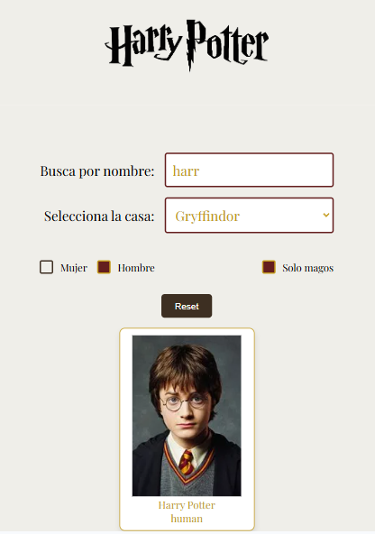
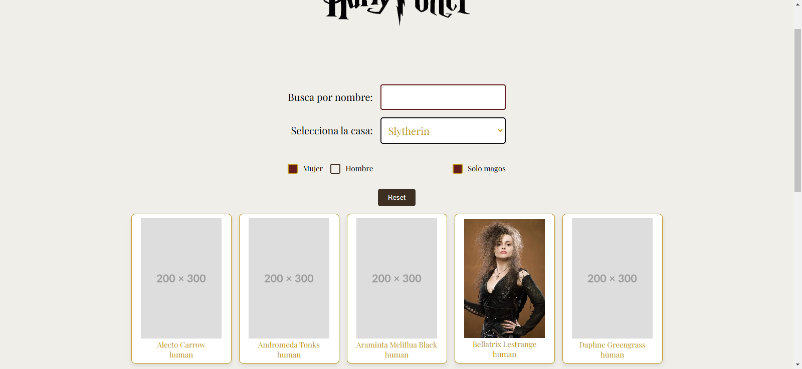

# Proyecto de Búsqueda de Personajes de Harry Potter

Este proyecto es una aplicación web interactiva construida con React que permite a los usuarios buscar personajes de la saga de Harry Potter por nombre, casa, género y si son magos o no.

## Tabla de Contenidos

- [Descripción](#descripcion)
- [Funcionalidades](#funcionalidades)
- [Tecnologías utilizadas](#tecnologias)
- [Instalación](#instalacion)
- [Uso](#uso)
- [Créditos](#creditos)

## Descripción

Esta aplicación web permite a los usuarios buscar y filtrar personajes de la saga de Harry Potter utilizando la API de Harry Potter (`https://hp-api.onrender.com/api/characters`). Los usuarios pueden buscar personajes por nombre, seleccionar una casa de Hogwarts, filtrar por género y si son magos o no.

## Funcionalidades

- **Búsqueda por nombre:** Permite a los usuarios buscar personajes escribiendo parte de su nombre.
- **Filtrado por casa:** Permite a los usuarios seleccionar una casa de Hogwarts para ver solo los personajes de esa casa.
- **Filtrado por género:** Permite a los usuarios seleccionar uno o ambos géneros (masculino y femenino) para ver solo los personajes de ese género.
- **Filtrado por mago:** Permite a los usuarios seleccionar si quieren ver solo magos, solo no magos o ambos.
- **Botón de reset:** Permite a los usuarios restablecer todos los filtros a sus valores por defecto.
- **Página de detalle del personaje:** Muestra información detallada sobre un personaje específico al hacer clic en su nombre.
- **Página 404:** Se muestra una página de error 404 si el usuario intenta acceder a una ruta que no existe.

## Tecnologías utilizadas

- **React:** Librería de JavaScript para construir interfaces de usuario.
- **React Router:** Librería para gestionar la navegación en la aplicación.
- **API de Harry Potter:** Fuente de datos de personajes.
- **HTML:** Estructura de la página web.
- **SCSS:** Estilos visuales de la página web.
- **PropTypes:** Librería para la validación de tipos de las props de los componentes.

## Instalación

1. Clona este repositorio: `git clone https://github.com/Adalab/modulo-3-evaluacion-final-TSalvatellaP.git`
2. Navega a la carpeta del proyecto: `cd modulo-3-evaluacion-final-TSalvatellaP`
3. Instala las dependencias: `npm install`

## Uso

1. Inicia la aplicación: `npm run dev`
2. Abre la aplicación en tu navegador: `http://localhost:3000`
3. Utiliza el cuadro de texto para buscar personajes por nombre.
4. Utiliza el menú desplegable para filtrar personajes por casa.
5. Utiliza los checkboxes para filtrar personajes por género.
6. Utiliza el checkbox para filtrar personajes por mago.
7. Haz clic en el botón "Resetear filtros" para restablecer todos los filtros.
8. Haz clic en el nombre de un personaje en la lista para ver su página de detalle.


## Estructura de carpetas
```
proyecto-harry-potter/
├── node_modules/         #Dependencias del proyecto
├── public/               # Archivos estáticos
│   └── index.html       # Punto de entrada HTML
├── src/                  # Código fuente de la aplicación
│   ├── components/       # Componentes reutilizables
│   │   ├── characters/    # Componentes relacionados con personajes
│   │   │   ├── CharacterCard.jsx    # Componente para mostrar una tarjeta de personaje
│   │   │   ├── CharacterDetail.jsx  # Componente para mostrar el detalle de un personaje
│   │   │   └── CharacterList.jsx    # Componente para mostrar la lista de personajes
│   │   └── filters/       # Componentes relacionados con filtros
│   │   │   ├── BtnReset.jsx       # Componente para el botón de reset
│   │   │   ├── FilterByGender.jsx   # Componente para filtrar por género
│   │   │   ├── FilterByHouse.jsx   # Componente para filtrar por casa
│   │   │   ├── FilterByName.jsx    # Componente para filtrar por nombre
│   │   │   ├── FilterByWizard.jsx  # Componente para filtrar por si es mago o no
│   │   │   └── Filters.jsx        # Componente que contiene todos los filtros
│   │   ├── App.jsx            # Componente principal de la aplicación
│   │   └── NotFound.jsx       # Componente para la página 404
│   ├── images/            # Imágenes utilizadas en la aplicación
│   ├── services/          # Servicios para interactuar con la API
│   │   └── api.js         # Función para realizar las llamadas a la API
│   ├── styles/            # Estilos CSS de la aplicación
│   │   ├── core/          # Estilos base y variables
│   │   │   ├── _mixins.scss      # Mixins de Sass
│   │   │   ├── _reset.scss       # Reset de estilos
│   │   │   └── _variables.scss   # Variables de Sass
│   │   ├── _characterDetail.scss # Estilos para el detalle del personaje
│   │   ├── _main.scss          # Estilos generales de la aplicación
│   │   ├── _notFound.scss       # Estilos para la página 404
│   │   └── App.scss           # Estilos para el componente App
│   └── main.jsx            # Punto de entrada principal de JavaScript
├── .gitignore             # Archivo para ignorar archivos en Git
├── eslint.config.js      # Configuración de ESLint
├── index.html             # Archivo HTML principal
├── package-lock.json      # Archivo de bloqueo de dependencias
├── package.json           # Archivo de configuración del proyecto
├── README.md              # Archivo README del proyecto
└── vite.config.js         # Archivo de configuración de Vite
```
## Créditos

Este proyecto fue desarrollado por [Tania_Salvatella].

---

## Ejemplo de uso





## Notas adicionales

- Puedes personalizar los estilos CSS para adaptarlos a tus preferencias.
- Si deseas agregar nuevas funcionalidades, como la paginación o la búsqueda por otras propiedades, puedes modificar el código fuente.
